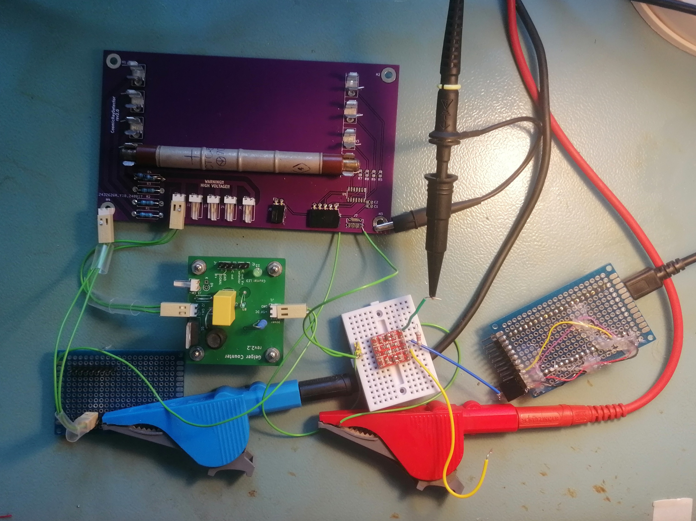
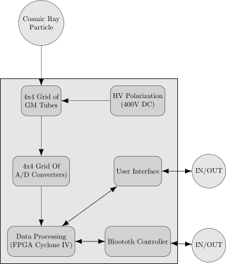

# CosmicRayDetector

**This project is unfinished.**

## Purpose

Cosmic radiation consists of a constant stream of high-energy particles originating from deep space. When these particles reach Earth, they collide with atoms in the atmosphere, producing a variety of secondary particles, one of which is the muon. This device is designed to detect these muons using a grid of Geiger tubes, while distinguishing them from Earth's natural background radiation. The goal is to create a more precise muon detection system using digital processing, allowing for enhanced readability and further data analysis on a PC, unlike other projects that rely on analog interfaces.

## Principle of Operation

When cosmic rays strike the Earth's atmosphere, they produce high-speed particles, such as muons, which can be detected by Geiger tubes. Due to their high energy, muons pass through Geiger tubes without being stopped, and if multiple tubes are aligned, a muon passing through one will likely pass through others, registering multiple detections. This behavior distinguishes muons from background radiation, which lacks the energy to penetrate multiple Geiger tubes.

To further reduce interference from background radiation, lead shielding is placed around the Geiger tubes. This setup allows the device to filter out low-energy radioactive particles from Earth's environment, isolating the detection of cosmic muons.

## Actual Hardware Version 

The device is the violet PCB. It probably doesn’t work - I can't say for sure because I forgot to buy all the components.

The story behind this device is actually quite interesting. The first version I created was a very small PCB. Depending on which components were soldered, it could be used in three different ways: as a user interface module (with a 4x4 LED grid and push buttons), to connect the GM tube on the "hot side" (connectors and a resistor to limit pulse current), or on the "cold side" (shunt resistor and ADC). It was a clever design to save money on PCB manufacturing, but it added a lot of complexity during assembly. I quickly realized that saving $10 wasn’t worth adding two hours of soldering work.

In the second version, I used NAND gates as an ADC. While I believe this setup would work, it's a bit too old-school, and it would make much more sense to use comparators instead.

The third version is currently under development.

As visible on the image, due to forgetting to buy the NAND gates, as a last resort, I attempted to use a high-to-low logic level converter with MOSFETs I had on hand. It didn’t work, and I didn’t have time to investigate further.

## System Architecture

The user interface is still to be determined.

Tools: PlantUML

## Hardware

* To generate the high voltage required by the Geiger tubes, the [DC/DC converter from this Geiger-Müller counter project](https://github.com/RobertGawron/GeigerMullerCounter) is utilized.
* The Geiger tube model used is the Soviet STS-5 (СТС-5).

Tools: KiCad (for PCB design).

## Software

Software doesn't exists yet.

* The FPGA (Cyclone IV) firmware will be written in Verilog using Quartus Lite as the IDE.
* See [Setting up the development environment on Windows](./wiki/Setting-up-development-environment-on-Windows) for more details.

## Hazards

**Warning: The device operates at high voltage, which can cause serious injury or death. Avoid touching the PCB or Geiger tubes while the device is powered on.**

## License
This project is licensed under the MIT License. See the [LICENSE](./LICENSE) file for details.
