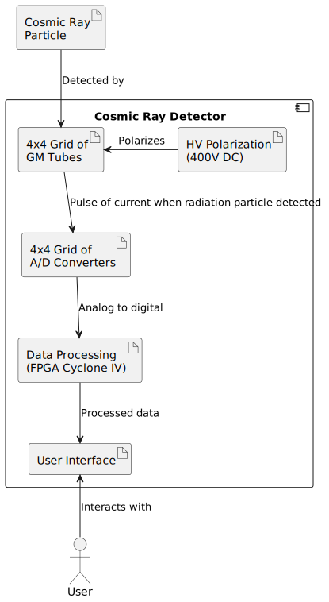

# CosmicRayDetector

**This project is unfinished.**

## Summary

Cosmic radiation is a constant stream of high energy particles from deep space, when they arrive on Earth they collide with atmosphere's atoms. Due to theirs high-speed (near light speed), during those collisions a lot of particles are made, one of them are muons that can be observed with Geiger tubes.

Earth has its own background radioactivity level and this would add to the measured muons, but there is a trick. Muons have high energy, so they will pass through Geiger tube (this will be detected) and won't be stopped, if near there is another Geiger tube they will pass through it as well (and it will be detected too). Radioactive particles from earth won't do that, they don't have enough energy. 

This device has a grid of Geiger tubes and analyzes if a particle went through many of them, if yes, it's probably a muon, if no, it's background radiation. To help minimize background radiation,  lead shielding will be placed around Geiger tubes.

There are similar projects around Internet, but they all have analog interface, this one is aiming to have digital processing, so that it will be possible to present results in more readable form, or to analyze them further on PC.

## System architecture

## Mechanical design

On the center of above image is visible a grid of 4x4 Geiger tubes. On the left and right sie are PCBs connected to GM Tubes, those PCB contains of A/D converters and are connected to FPGA board visible on top left side of the image. On the right side is visible a stack of PCBs, those are connected to GM tubes, and high voltage generator, that is visible on top right side. In front of the image, on the left is visible a PCB of a display. 

Parts for 3D printing and model of the whole device were designed in OpenSCAD. Above renderer was done in Blender.

## Hardware

* [DC/DC converter from this Geiger-Muller counter](https://github.com/RobertGawron/GeigerMullerCounter) was used as a source of high voltage.
* Geiger tube model is STS-5 (СTC-5) 

PCB was designed in KiCAD.

## Software

* FPGA (Cyclone IV) firmware will be written in verilog using QuartusLite as IDE. 
* [Setting up development environment on Windows
](https://github.com/RobertGawron/CosmicRayDetector/wiki/Setting-up-development-environment-on-Windows)

## Hazards

* **The device uses high voltage and can lead to unpleasant shock, injury or death. Don't touch the PCB or tubes when power is on.**
